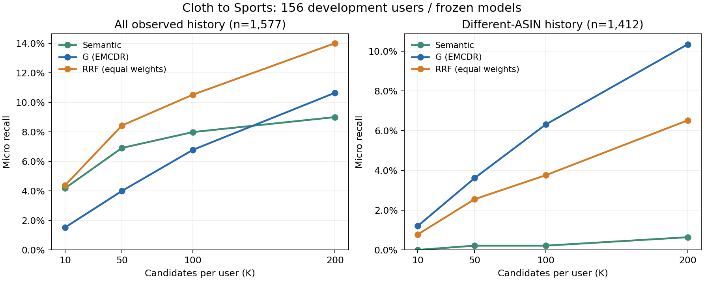

# Cloth→Sports 候选召回诊断

## 设置与运行登记

状态：全部156位开发用户的召回诊断已完成；运行服务器为本机 `F:\Projects\MultiAgentCDR`，无需GPU或LLM。

- 源码：`scripts/diagnose_candidate_recall.py`；汇总/绘图：`scripts/summarize_candidate_recall.py`；测试：`tests/test_candidate_recall_diagnostics.py`。
- 输入：v2可见数据包 `CDRec/data/agent_evidence/cloth_to_sports/server_bundle_v2/`，既有服务器归档 `doc/experiments/2026-10-06_featurize_real/artifacts/MultiAgentCDR/runs/pilot_v1/encoder/` 与 `g/`。
- 范围：全部156位内部prompt_dev用户，沿用已冻结BGE与EMCDR G，目标目录18,357物品。
- 每用户预算：10/50/100/200；方法为语义TopK、G TopK、RRF TopK。RRF每路固定Top200，常数60；各K截取同一排名前缀，避免候选数量变化时同时改变融合池。
- 补充union对照：语义TopK与G TopK并集，最多2K物品，属于更大预算参照，不能与K总预算方法当作等预算比较。
- 主结果保留原目标目录、不排除源历史同ASIN；另按源历史同ASIN/不同ASIN分层。
- 补充排除版本：仅根据可见源历史ASIN，在各路TopK与RRF融合前过滤并补足候选。原Benchmark数据与划分不修改。
- 缺少正评价语义画像时，语义候选为空，G继续可用；并列分数按物品ID升序。
- prepare不读取任何隐藏反馈；rankings完成并校验后，evaluate只读取 `hidden_feedback/prompt_dev.pkl`，内部prompt_val与正式验证/测试保持未读取。不插入隐藏正例。
- 评价：已观察交互匹配数/率、完整隐藏历史的micro/macro recall、命中用户比例；不同ASIN recall使用不同ASIN隐藏交互作分母。无对应真值的用户不计入该分层macro均值，并报告数量。
- 原20位/200候选按每路Top50、RRF常数60、最终10个重新生成并核对。其历史200候选与分数、11个匹配/2个不同ASIN匹配应复现。
- 已观察交互不等于正偏好，未匹配不等于不喜欢。本轮不生成完整四角色证据/反馈，也不评价下游训练收益。

## 日志与产物

目录：`doc/experiments/2026-10-06_candidate_recall/`。

- `request.json`：在生成候选前冻结设置、代码与缓存版本。
- `prepare.log`、`evaluate.log`、`tests.log`：运行/评价/测试日志。
- `rankings.jsonl`：仅可见输入构造的候选ID、逐路排名、RRF排名及源历史同ASIN标记；无目标标签。
- `scores.npz`：全开发用户语义/G分数缓存，本机保留、不进入Git。
- `generation_audit.json`、`manifest.json`：缓存校验、旧试点复算与候选文件哈希。
- `aggregate_metrics.csv`、`per_user_metrics.csv`、`results.json`：全量和逐用户评价。
- `observed_history_evaluation_only.csv`：仅供诊断的隐藏开发交互匹配，不可作为Agent输入。
- `evaluation_manifest.json`、`evaluation_status.json`、`verification.json`：评价完整性与最终状态。
- `recall_curves.png`、`recall_curves.svg`：标准目录下的总体/不同ASIN召回曲线。

## 运行命令

```powershell
F:\anaconda3\python.exe -m unittest discover -s tests -p test_candidate_recall_diagnostics.py
F:\anaconda3\python.exe scripts/diagnose_candidate_recall.py prepare
F:\anaconda3\python.exe scripts/diagnose_candidate_recall.py evaluate
F:\anaconda3\python.exe scripts/summarize_candidate_recall.py
```

## 结果

## 结论摘要

全部156位开发用户召回诊断已完成；隐藏Sports历史1,577条，其中源历史已有同ASIN165条、不同ASIN1,412条。当前165条只按物品ASIN对应分类，没有逐条证明原始评论相同；此前20用户中的9条重复评论已在上一轮核验。

1. 增加候选有用：标准RRF从每人10个扩大到200个，全部已观察命中69→221，总体Recall 4.38%→14.01%；不同ASIN命中11→92。
2. 当前语义召回主要覆盖源历史已有物品：Top200命中142条，其中133条同ASIN、不同ASIN仅9条；不同ASIN Recall只有0.64%。该结论限定现有BGE画像与当前开发集，不代表语义方法普遍无效。
3. 不同ASIN覆盖以G更好：G Top200不同ASIN命中146条/1,412=10.34%，RRF Top200为92条/1,412=6.52%。固定等权RRF虽然总体命中更多，但不同ASIN覆盖低于G单独召回。
4. 每路Top200并集有61,674候选，全部命中290、不同ASIN154（10.91%）；G Top200有31,200候选、不同ASIN146。扩大两路并集几乎翻倍候选预算，仅额外覆盖8条不同ASIN交互。
5. 用户1753没有可用的正评价语义画像，其语义召回为空，G仍正常。因此语义总候选数是155×K，G/RRF是156×K；不同ASIN隐藏历史存在于155位用户，分层macro分母为155而不是156。

## 标准目录：同总预算比较

总体Recall=命中/1,577；不同ASIN Recall=不同ASIN命中/1,412。表中候选集合含两种ASIN，原Benchmark不修改。语义有1位用户无画像，其他用户使用相同K预算。

| 方法 | 每人K | 候选数 | 全部命中 | 总体Recall | 同ASIN命中 | 不同ASIN命中 | 不同ASIN Recall |
| --- | --- | --- | --- | --- | --- | --- | --- |
| 语义 | 10 | 1550 | 66 | 4.19% | 66 | 0 | 0.00% |
| G | 10 | 1560 | 24 | 1.52% | 7 | 17 | 1.20% |
| RRF合并 | 10 | 1560 | 69 | 4.38% | 58 | 11 | 0.78% |
| 语义 | 50 | 7750 | 109 | 6.91% | 106 | 3 | 0.21% |
| G | 50 | 7800 | 63 | 3.99% | 12 | 51 | 3.61% |
| RRF合并 | 50 | 7800 | 133 | 8.43% | 97 | 36 | 2.55% |
| 语义 | 100 | 15500 | 126 | 7.99% | 123 | 3 | 0.21% |
| G | 100 | 15600 | 107 | 6.79% | 18 | 89 | 6.30% |
| RRF合并 | 100 | 15600 | 166 | 10.53% | 113 | 53 | 3.75% |
| 语义 | 200 | 31000 | 142 | 9.00% | 133 | 9 | 0.64% |
| G | 200 | 31200 | 168 | 10.65% | 22 | 146 | 10.34% |
| RRF合并 | 200 | 31200 | 221 | 14.01% | 129 | 92 | 6.52% |

## 两路并集：更大预算参照

每路各取K后并集去重，最多每人2K；不能把该表与总预算K的上表当作等预算收益。

| 每路K | 实际候选总数 | 全部命中 | 总体Recall | 不同ASIN命中 | 不同ASIN Recall |
| --- | --- | --- | --- | --- | --- |
| 10 | 3108 | 88 | 5.58% | 17 | 1.20% |
| 50 | 15519 | 165 | 10.46% | 54 | 3.82% |
| 100 | 30969 | 220 | 13.95% | 92 | 6.52% |
| 200 | 61674 | 290 | 18.39% | 154 | 10.91% |

## 补充：召回前排除用户源历史同ASIN并补足K

过滤仅根据可见源历史，不使用隐藏目标历史。此为新物品迁移诊断，不覆盖或替代标准Benchmark结果。该版本的命中均为不同ASIN，Recall分母为1,412。

| 方法 | 每人K | 候选数 | 不同ASIN命中 | 不同ASIN Recall |
| --- | --- | --- | --- | --- |
| 语义 | 10 | 1550 | 0 | 0.00% |
| G | 10 | 1560 | 18 | 1.27% |
| RRF合并 | 10 | 1560 | 12 | 0.85% |
| 语义 | 50 | 7750 | 3 | 0.21% |
| G | 50 | 7800 | 51 | 3.61% |
| RRF合并 | 50 | 7800 | 36 | 2.55% |
| 语义 | 100 | 15500 | 3 | 0.21% |
| G | 100 | 15600 | 89 | 6.30% |
| RRF合并 | 100 | 15600 | 53 | 3.75% |
| 语义 | 200 | 31000 | 9 | 0.64% |
| G | 200 | 31200 | 146 | 10.34% |
| RRF合并 | 200 | 31200 | 92 | 6.52% |

## 每用户指标：标准Top200

micro按隐藏交互总数加权；macro先计算各用户召回再平均。完整逐用户结果见 `per_user_metrics.csv`，包含无命中用户。

| 方法 | 总体micro | 总体macro | 不同ASIN micro | 不同ASIN macro | 有命中用户/156 |
| --- | --- | --- | --- | --- | --- |
| 语义 | 9.00% | 13.09% | 0.64% | 1.11% | 80 |
| G | 10.65% | 10.77% | 10.34% | 10.39% | 79 |
| RRF合并 | 14.01% | 17.72% | 6.52% | 6.78% | 106 |

## 复现与完整性

- 原20用户/200候选完全复现，语义分数最大绝对误差2.38e-7，G为4.77e-7；旧候选隐藏历史匹配11条、不同ASIN2条复现。
- 新RRF采用固定每路Top200，旧试点是每路Top50，因此新Top10与旧Top10可能不是同一名单；候选深度已经在计算前登记，不把两种配置混作同一方案。
- 32组结果=2种ASIN策略×4种召回方法×4个K。候选随K嵌套、无重复、ID/分数合法；统计与逐用户/隐藏历史记录独立核对。
- 候选缓存的bundle、BGE、G与源码SHA256均已固定；候选生成阶段不读取隐藏目标标签。仅评价阶段读取内部prompt_dev.pkl，内部prompt_val及正式测试未读取。
- 5项指标测试通过，含完整历史分母、无命中用户、不同ASIN分母为空、RRF并列/并集预算、ASIN跨域编号和先过滤再补足候选；156项独立统计/完整性检查通过，记录见 `verification.json`。
- 本机候选生成6.459秒，开发历史匹配0.280秒，不含脚本编写、检查与文档同步；Qwen调用0次、GPU使用0次。

## 完成范围与后续建议

本轮完成所有156位开发用户的候选排名与覆盖评价，未为这些新增候选生成完整四角色输入或LLM反馈。已有排名可供下一步导出四类证据，评价CSV中的目标标签不得回填到Agent输入。

建议下一轮以G Top100/200作为不同ASIN召回基准，并保留标准RRF和语义对照；先小规模修正v6字段解释与判断准则、在固定候选上对照v5/v6。是否采用排除同ASIN版本需与标准Benchmark结果分开登记。当前G Top200不同ASIN覆盖仍只有10.34%，召回改进也需继续推进。

本轮指标描述已观察隐藏交互覆盖，不是喜欢/不喜欢准确率、完整推荐HR/NDCG、Agent筛选增益或下游训练收益；未匹配不能作为C金标签。所有开发用户已用于诊断，独立内部验证仍留待方案冻结后评价。

## 召回曲线



Notion：[候选召回诊断](https://app.notion.com/p/3f16864168f5816e9834ee1b6ab84306)。
