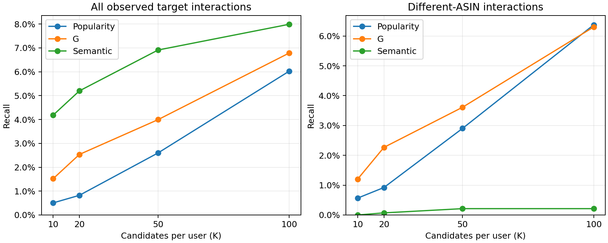

# Cloth→Sports 召回预算对照

## 设置与登记

已完成并复核；本机CPU，比较Popularity/G/语义在每用户Top10、20、50、100的覆盖。全部156位开发用户，沿用已有可见训练构造的冻结排名，各K截取同一排名前缀。Popularity按可见Sports训练交互次数排序、所有用户共用同一名单；标准目录保留同ASIN并在评价时分层。

候选前缀完成并冻结后，使用已保存的内部开发评价记录复算指标。隐藏Sports交互总数1,577，不同ASIN1,412；语义有一位用户无正评价画像，候选数155×K，其他方法156×K。不同ASIN逐用户平均分母155位有对应隐藏历史的用户；命中用户数保留全部156位。内部验证和正式测试不读取，不重训模型、不调用Qwen；GPU实验继续暂停。

## 源码与日志

- 独立脚本：`scripts/evaluate_recall_budgets.py`，共享已有指标汇总函数。输入为已归档Popularity及语义/G候选排名和开发评价记录，不修改原实验。
- 产物目录：`doc/experiments/2026-10-06_recall_budgets/`；`request.json`与`manifest.json`冻结候选；`rankings_top100.jsonl`无标签；`aggregate_metrics.csv`、`per_user_metrics.csv`、`results.json`及`results_table.md`记录结果。
- 日志`evaluate.log`；`verification.json`核对嵌套候选、独立交集计数及已有结果复现；`evaluation_manifest.json`记录结果哈希。曲线`recall_vs_budget.png`与`recall_vs_budget.svg`。
- 复现：`F:\anaconda3\python.exe scripts/evaluate_recall_budgets.py`。

## 结果

同一156位开发用户、同一冻结排名前缀；总体Recall分母1,577，不同ASIN Recall分母1,412。不同ASIN逐用户平均仅包含155位具有对应隐藏历史的用户；命中用户列按156位计数。Popularity/G候选数156×K，语义155×K（一位用户无可用画像）。

| K | 方法 | 总体Recall | 同ASIN命中 | 不同ASIN命中 | 不同ASIN Recall | 不同ASIN逐用户平均 | 不同ASIN命中用户 |
| --- | --- | --- | --- | --- | --- | --- | --- |
| 10 | Popularity | 0.51% | 0 | 8 | 0.57% | 0.52% | 6 |
| 10 | G | 1.52% | 7 | 17 | 1.20% | 1.18% | 15 |
| 10 | 语义 | 4.19% | 66 | 0 | 0.00% | 0.00% | 0 |
| 20 | Popularity | 0.82% | 0 | 13 | 0.92% | 0.81% | 8 |
| 20 | G | 2.54% | 8 | 32 | 2.27% | 2.23% | 23 |
| 20 | 语义 | 5.20% | 81 | 1 | 0.07% | 0.16% | 1 |
| 50 | Popularity | 2.60% | 0 | 41 | 2.90% | 2.09% | 30 |
| 50 | G | 3.99% | 12 | 51 | 3.61% | 3.76% | 35 |
| 50 | 语义 | 6.91% | 106 | 3 | 0.21% | 0.45% | 3 |
| 100 | Popularity | 6.02% | 5 | 90 | 6.37% | 4.66% | 50 |
| 100 | G | 6.79% | 18 | 89 | 6.30% | 6.11% | 51 |
| 100 | 语义 | 7.99% | 123 | 3 | 0.21% | 0.45% | 3 |

## 观察与复核

- 在Top10/20/50的小预算下，G不同ASIN命中17/32/51，Popularity为8/13/41；Top100达到89对90，总覆盖接近。
- 语义不同ASIN命中从Top50到Top100保持3条；总体命中从109增至126，新增17条均为同ASIN。
- Popularity从Top50到Top100新增49条不同ASIN命中，G新增38条；不能仅凭Top100结果推断所有预算的相对效果。
- 12组指标独立交集核对通过，1,872条逐用户记录；候选随K嵌套，7组已有指标完全复现。未读取内部验证或正式测试；LLM调用0次。
- Recall随K增加而不下降不代表候选质量同比提高；候选匹配率与逐用户指标另见CSV。未评价Agent筛选和下游推荐收益；GPU实验保持暂停。

## 曲线

Notion：[召回预算对照](https://app.notion.com/p/3f16864168f5811bad62d6be75bf86d9)。

